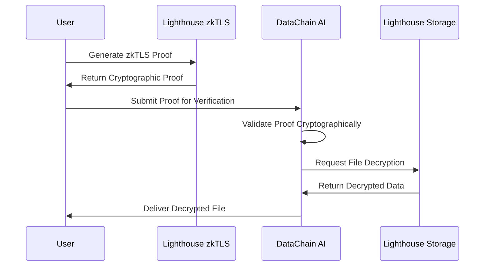
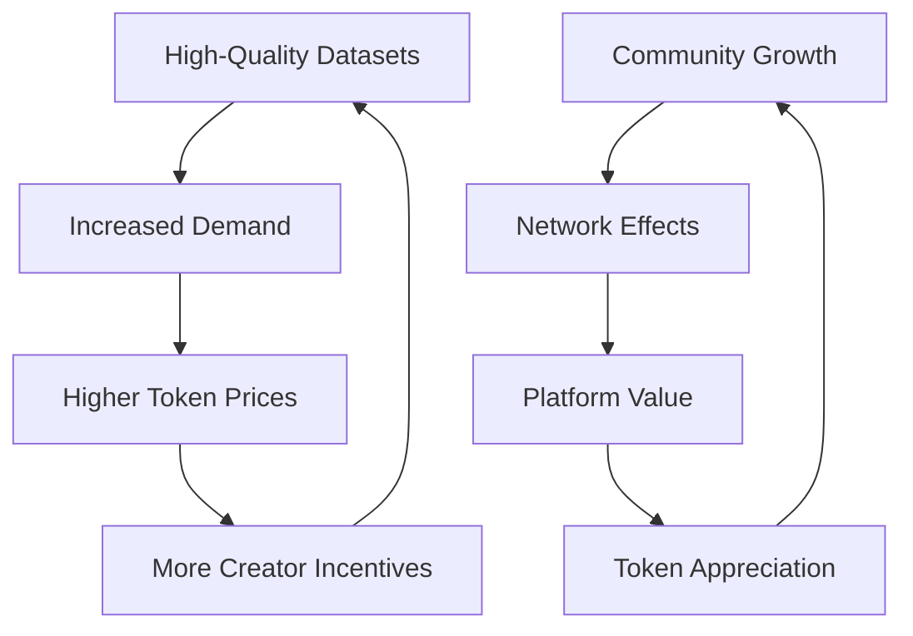

# DataChain AI

*The first decentralized marketplace for AI datasets with verifiable performance metrics and privacy-preserving access control.*

## Overview

DataChain AI transforms how artificial intelligence datasets are created, shared, and monetized. We've built the world's first marketplace where AI datasets become tradeable digital assets with cryptographically verified performance metrics, zero-knowledge privacy controls, and Sybil-resistant human verification.

## The Problem We're Solving

The AI industry faces a fundamental data crisis. Data scientists spend 80% of their time hunting for quality datasets instead of building AI solutions. When they do find data, there's no way to verify its authenticity, performance metrics, or provenance. Meanwhile, researchers who create valuable datasets have no mechanism to monetize their work, often giving away years of effort for free on platforms flooded with bots and fake accounts.

The current landscape lacks trust, transparency, and fair economic incentives. AI companies can't verify dataset authenticity, researchers struggle with access control and licensing, and privacy is consistently compromised when sensitive data is shared.

## Our Solution

DataChain AI creates a trustless marketplace where datasets become intelligent assets. We combine cutting-edge blockchain technology with advanced cryptographic privacy to solve the core problems of AI data sharing:

*Verifiable AI Agent NFTs*: Every dataset is tokenized as an ERC-1155 NFT with cryptographically linked performance metrics. No more fake accuracy claims or unverifiable model statistics.

*Zero-Knowledge Privacy*: Using Lighthouse's zkTLS technology, data creators can set sophisticated access controls that verify user credentials without exposing personal information or dataset contents.

*Fractional Ownership*: Transform datasets into investable assets through fractional ownership, allowing communities to collectively invest in and benefit from AI model development.

*Sybil Resistance*: World ID integration ensures only verified humans participate in the marketplace, eliminating bot manipulation and fake account creation.

*Decentralized Storage*: All datasets are encrypted and stored on Lighthouse's IPFS network, ensuring permanent availability without central points of failure.

## Core Features


```
npx hardhat ignition deploy ignition/modules/AIAgent.js --network sepolia
[dotenv@17.2.2] injecting env (4) from .env -- tip: ⚙️  override existing env vars with { override: true }
✔ Confirm deploy to network sepolia (11155111)? … yes

Compiled 19 Solidity files successfully (evm target: paris).
Hardhat Ignition 🚀

Deploying [ AIAgentModule ]

Batch #1
  Executed AIAgentModule#AgentStorage

Batch #2
  Executed AIAgentModule#AIAgentBatchNFT

Batch #3
  Executed AIAgentModule#AgentStorage.setMainContract

[ AIAgentModule ] successfully deployed 🚀

Deployed Addresses

AIAgentModule#AgentStorage - 0xE39E63dF14B1b916A8aC1c777D956865BBD87218
AIAgentModule#AIAgentBatchNFT - 0x3Adcdf52260fEbe0776B02ab031A3A68Cae50592

```

### AI Agent NFTs

Transform your AI models and datasets into verifiable digital assets with our ERC-1155 smart contract system.

*Key Features:*
- Verifiable performance metrics including accuracy, training epochs, and dataset size
- Classification by AI type: NLP, Computer Vision, Classification, Regression, Reinforcement Learning
- Configurable supply economics with limited edition tokens
- Full creator control over metadata, availability, and access permissions

### Zero-Knowledge Privacy Engine

Our privacy engine leverages Lighthouse's zkTLS technology to enable sophisticated access controls without compromising user privacy or dataset security.

*Privacy Features:*
- End-to-end encryption before IPFS storage
- Attribute-based access control using zkTLS proofs
- Automated verification and decryption workflows
- Zero-knowledge credential verification without data exposure

*Real-World Applications:*
- Medical datasets restricted to licensed healthcare professionals
- Financial data accessible only to certified financial analysts
- Academic research datasets limited to verified researchers
- Corporate datasets with company-specific access requirements
- Human-verified access through World ID integration

### Smart Contract Architecture

Our smart contract system is built with a modular, gas-optimized architecture that prioritizes security and efficiency.

*Contract Features:*
- Batch operations for creating and minting multiple agents in single transactions
- Library-based architecture reducing gas costs by up to 40%
- Modular design enabling future upgrades and enhancements
- Comprehensive security measures including ReentrancyGuard and input validation

### World ID Human Verification

We integrate Worldcoin's World ID system to ensure authentic human participation and eliminate Sybil attacks in our marketplace.

*Anti-Sybil Features:*
- Biometric verification ensuring only real humans can create AI Agent NFTs
- Orb-level verification providing the highest security through proof of personhood  
- Comprehensive bot protection preventing fake account manipulation
- Fair access mechanisms guaranteeing equal opportunities for genuine users

*World ID Benefits:*
- Privacy-preserving verification that proves humanity without revealing identity
- Seamless MiniKit integration for instant verification experiences
- Robust fraud prevention eliminating fake accounts and manipulation attempts
- Global accessibility through Worldcoin's worldwide verification network
- Economic fairness ensuring authentic participation in the AI dataset marketplace

### Fractional Ownership and Economics

Our tokenomics system enables fractional ownership of AI datasets through ERC-1155 tokens, creating new economic models for AI development.


*Revenue Streams:*
- Automatic creator royalties on all secondary sales
- Sustainable 2.5% platform fee structure
- Future utility token distribution for staking participants
- Governance rights allowing token holders to vote on model updates and platform decisions

## Technical Architecture

### Frontend Technology Stack

Our frontend leverages modern web technologies for optimal performance and user experience:

- *Framework*: Next.js 15.5.4 with React 19
- *UI Components*: Tailwind CSS with Radix UI primitives  
- *Blockchain Integration*: Thirdweb v5 SDK for Web3 functionality
- *Storage*: Lighthouse IPFS for decentralized file storage
- *Privacy*: zkTLS integration for zero-knowledge proofs
- *Identity*: World ID MiniKit for human verification
- *Analytics*: Vercel Analytics for performance monitoring

### Blockchain Infrastructure  

Our smart contracts are deployed on Ethereum's Sepolia testnet with production-ready architecture:

- *Network*: Ethereum Sepolia Testnet (Chain ID: 11155111)
- *NFT Contract*: 0x3Adcdf52260fEbe0776B02ab031A3A68Cae50592
- *Storage Contract*: 0xE39E63dF14B1b916A8aC1c777D956865BBD87218
- *Token Standard*: ERC-1155 for multi-token functionality
- *Architecture*: Gas-optimized library-based design

### Privacy and Storage Systems

Our privacy and storage infrastructure ensures data security and access control:

*Storage Layer:*
- Decentralized storage via Lighthouse's IPFS network
- End-to-end encryption for all uploaded datasets
- Redundant node distribution for high availability
- Optimized gateways for fast content delivery

*Privacy Layer:*
- Lighthouse zkTLS integration for zero-knowledge proofs
- Cryptographic verification without data exposure
- Attribute-based access control systems
- Automated proof validation and verification

## Quick Start Guide

### 1. Clone & Install
```bash
git clone https://github.com/kunalsinghdadhwal/probable-eureka.git
cd probable-eureka
pnpm install
```

### 2. Environment Setup
```bash
cp .env.example .env.local
```

```env
# Core Configuration
NEXT_PUBLIC_THIRDWEB_CLIENT_ID=your_thirdweb_client_id
NEXT_PUBLIC_LIGHTHOUSE_API_KEY=your_lighthouse_api_key  
AUTH_PRIVATE_KEY=your_private_key
NEXT_PUBLIC_THIRDWEB_AUTH_DOMAIN=localhost:3000

# Optional Features  
APP_ID=your_worldcoin_app_id
```


### 3. Deploy Smart Contracts
```bash
cd proabable-eureka-contracts
npm install
npx hardhat compile
npx hardhat test
npx hardhat ignition deploy ignition/modules/AIAgent.js --network sepolia
```

### 4. Launch Development
```bash
pnpm dev
# Open http://localhost:3000 in your browser
```

## User Experience

### For AI Dataset Creators

The creator journey is designed to be straightforward while maintaining security and verification standards:

1. *World ID Verification*: Complete biometric verification through Worldcoin's system to prove human identity
2. *Dataset Upload*: Securely upload datasets with automatic encryption to Lighthouse IPFS
3. *Access Control Setup*: Configure zkTLS conditions defining who can access your dataset
4. *NFT Tokenization*: Create an AI Agent NFT with verifiable performance metrics and metadata
5. *Economic Configuration*: Set pricing, supply limits, and royalty rates for your dataset
6. *Marketplace Launch*: Make your dataset available to the global AI community
7. *Revenue Generation*: Automatically receive payments and ongoing royalties

### For AI Developers and Companies

Developers and organizations can easily discover and access high-quality datasets:

1. *Browse and Discover*: Explore verified AI agents categorized by type and performance metrics
2. *Verify Authenticity*: Review cryptographically verified performance data and community ratings
3. *Purchase Tokens*: Acquire fractional ownership tokens representing dataset access rights
4. *Provide Credentials*: Submit zkTLS proofs demonstrating qualification for dataset access
5. *Access Data*: Receive decrypted dataset access after successful verification
6. *Build Solutions*: Utilize high-quality, verified data to create AI applications

## Smart Contract Implementation


### zkTLS Proof Flow

## Real-World Applications

### Healthcare AI
- *Medical Image Datasets*: Radiology, pathology, diagnostic imagery
- *Clinical Trial Data*: Anonymized patient outcomes and treatments  
- *Drug Discovery*: Molecular structures and interaction data
- *Access Control*: Only verified medical professionals

### Financial Services
- *Market Data*: High-frequency trading datasets
- *Risk Models*: Credit scoring and fraud detection data
- *Compliance Data*: Regulatory reporting and audit trails
- *KYC Verification*: Identity verification through zkTLS

### Academic Research  
- *Scientific Datasets*: Climate, genomics, physics experiments
- *Social Science Data*: Survey responses, behavioral studies
- *Collaborative Research*: Multi-institutional data sharing
- *Publication Rights*: Automatic attribution and citations

### Gaming and Entertainment
- *Player Behavior*: Gaming analytics and user interaction data
- *Content Generation*: AI training data for NPCs and environments  
- *Recommendation Systems*: User preference and engagement data
- *Community Access*: Token-gated communities and experiences

## Economic Model and Tokenomics


### Token Utility and Governance

Our token system provides multiple layers of utility and governance participation:

- *Ownership Rights*: Fractional ownership of AI models and datasets through ERC-1155 tokens
- *Governance Power*: Token holders can vote on platform upgrades and parameter changes
- *Revenue Sharing*: Earn rewards from platform fees and model performance metrics  
- *Access Control*: Premium features and advanced analytics for token holders
- *Staking Rewards*: Lock tokens to earn additional yield and platform benefits

### Market Dynamics

### Technical Innovation Highlights

DataChain AI represents several industry firsts and technological breakthroughs:

- **First AI Dataset NFT Marketplace**: The world's first marketplace for AI datasets with cryptographically verifiable performance metrics
- **Lighthouse zkTLS Pioneer**: Advanced implementation of zero-knowledge proofs for decentralized storage access control
- **Fractional AI Asset Ownership**: Revolutionary economic model enabling community investment in AI development
- **Privacy-Preserving Data Sharing**: End-to-end encrypted sharing with sophisticated access controls
- **Sybil-Resistant Verification**: Integration of World ID ensuring authentic human participation in AI markets


---

*Links*: [GitHub Repository](https://github.com/kunalsinghdadhwal/probable-eureka)<br>
Built for ETHGlobal 2024 - Advancing the intersection of blockchain technology and artificial intelligence.

---

*Built with leading open-source technologies:*

[](https://nextjs.org/)
[](https://ethereum.org/)  
[](https://thirdweb.com/)
[](https://lighthouse.storage/)
[](https://lighthouse.storage/)
[](https://worldcoin.org/)
